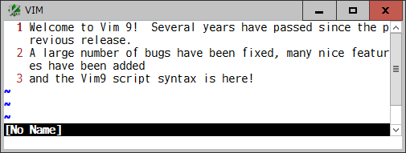
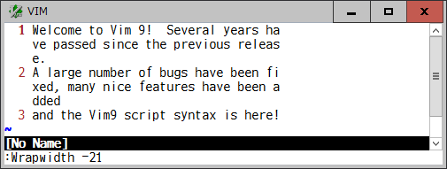

# wrapwidth

### Wraps long lines visually at a specific column

The `wrap` option is useful but no way to select a column to be wrapped. And
the `textwidth` and `wrapmargin` options break a long line but it is hard
wrapped in insert mode.

This plugin provides the *Wrapwidth* command to set a column at which a longer
line will be visually wrapped. When `wrap` is on, the required number of blank
spaces are inserted as **virtual-text** at right edge of each screen line.

While *wrapwidth* is enabled, those virtual spaces will be adjusted with wrap
related (`linebreak`, `breakat`, `showbreak`, `breakindent`,
`breakindentopt`), width related (`number`, `relativenumber`, `numberwidth`,
`signcolumn`, `foldcolumn`), and tab related (`tabstop`, `vartabstop`)
options, as well as the `WinScrolled` and `TextChanged` events.

If `list` is on, an "extends" character specified in `listchars` is shown
instead of a blank space.

Note that the inline **virtual-text** feature has been implemented in vim
post-9.0 patches and nvim 0.10.0.

#### Command

* `:Wrapwidth N`
  * Set a *wrapwidth* at the N-th column in the current window. A longer line
    will be visually wrapped at that column and continued to the next screen
    line.
    - N > 0: a text width from left edge of a text, like `textwidth`
    - N < 0: a wrap margin from right edge of a window, like `wrapmargin`
    - N = 0: disables the *wrapwidth*

#### Option

* `b:wrapwidth_hl`, `g:wrapwidth_hl`
  * A highlight group name to make *wrapwidth* virtual spaces visible.
